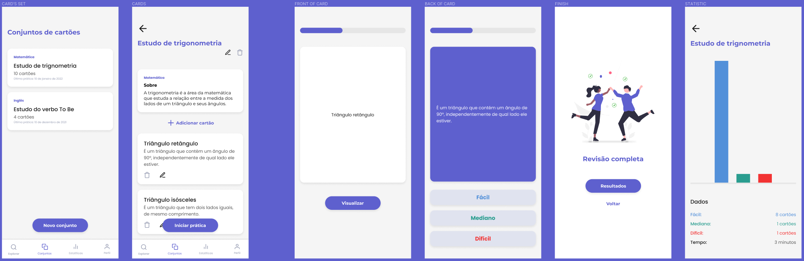

[](https://eslint.org/)
[](https://github.com/airbnb/javascript)
[](https://prettier.io/)
[](https://www.typescriptlang.org/)
[](https://docs.expo.dev/)
[](https://pt-br.reactjs.org/)
[](https://reactnative.dev/)
[](https://react-hook-form.com/)
[](https://axios-http.com/ptbr/docs/intro)
[](https://styled-components.com/)


<div align="center">

# MemoryFlash

[](https://drive.google.com/drive/folders/1CMqqKnogi9OgLcfSCCEM6BPJX8VxX22X?usp=sharing)
[](https://www.figma.com/file/BytUU1zYyZ925bObTD73IX/MemoryFlash?node-id=2%3A5)

O **MemoryFlash** é uma aplicação mobile de _flashcards_, cartões com perguntas e respostas, que permite ao usuário criar cartões de estudo, praticar, acompanhar seu progresso, compartilhar e obter flashcards de outros usuários.

</div>


<br/>
<br/>
<br/>

## Requisitos

Para rodar a aplicação, você precisará ter instalado na sua máquina:

- [Node.js](https://nodejs.org/)
- [Expo CLI](https://docs.expo.dev/)

## Como rodar

Para baixar as dependências:

```
$ npm
```
Ou

```
$ yarn
```

Para rodar no celular, certifique-se de que seu computador e no seu dispositivo estejam na mesma rede Wi-fi.


```
$ expo start
```

Leia o QR Code gerado com o aplicativo **Expo Go**.
